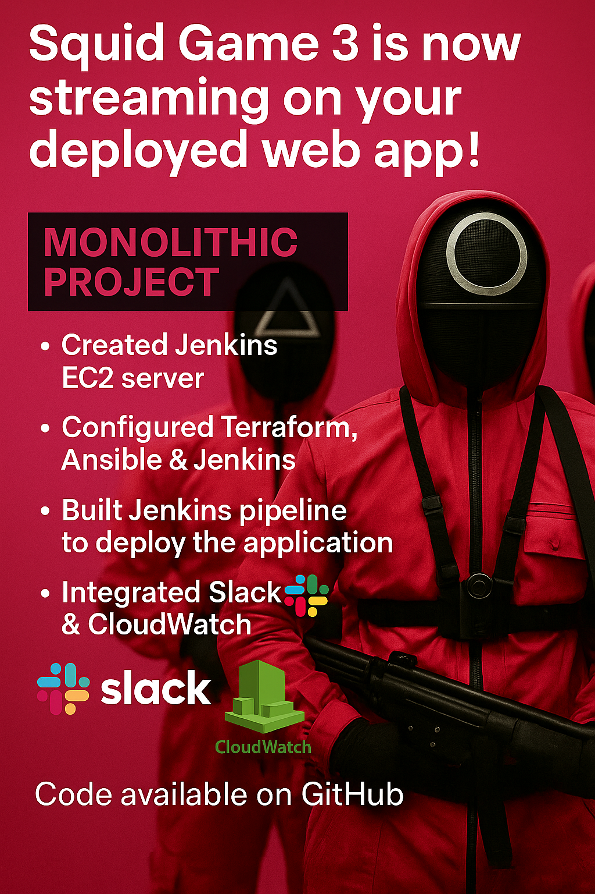

Squid Game DevOps Project

# 🧩 Project Breakdown — Behind the Scenes

## 🔧 Infrastructure & Automation  
- ✅ Launched a **Jenkins EC2** server on AWS  
- ✅ Installed & configured **Terraform**, **Ansible**, and **Jenkins**  
- ✅ Built a **scripted Jenkins pipeline** that:
  - Pulls the code from **GitHub**
  - Runs **Terraform**: `init`, `plan`, `apply`, and `destroy` via choice parameters
  - Executes **Ansible Playbooks** to install packages and deploy the app  

## 📡 Real-Time Feedback  
- 🔔 Integrated **Slack**  notifications for every pipeline stage  

## 📊 Observability & Monitoring  
- 🧠 Integrated **AWS CloudWatch**  to:
  - Monitor **CPU Utilization**
  - Trigger **Alarm Email Alerts** on threshold breach
  - Collect full application **logs** into CloudWatch Logs  

## 🌐 Final Output  
A live website that proudly announces:  
**“Squid Game 3 is now streaming on Netflix!”**  

> Just for fun — but entirely deployed through real automation & CI/CD workflows!

---
